# Fábrica de software 2025/2

Guilherme Passos de Borba

## Sistema para controle de pagamentos de partidas de futebol
  * Cadastro de usuário
  * Cadastro de uma partida
  * Atualização de status de pagamento


## Aula 05/08

- JRE - Java Runtime Environment
    - Ambiente mínimo para executar um programa Java
    - JVM - Java Virtual Machine (java.exe ou javaw.exe)

- JDK - Java Devlopment Kit
    - Ambiente de desenvolvimento (javac.exe - compilador)

- Compilaçãot
  1) Escreve um programa em java (arquivo.java)
  2) Compilação -> arquivo.java -> javac.exe -> bytecode ou arquivo.class)
- Execução
  3) Passar .class para java.exe (JVM) -> linguagem de máquina


## Histórias de usuários

1) Eu como usuario, gostaria fazer meu cadastro no aplicativo.
2) Eu como usuario, gostaria de criar um sala para um partida de futebol.
3) Eu como usuario, gostaria de entrar em uma sala de uma partida de futebol existente.
4) Eu como usuario criador de uma sala, gostaria de poder cadastrar uma chave PIX na sala.
5) Eu como usuario criador de uma sala, gostaria de atualizar os status de pagamento na lista de todos os participantes da sala.

##

```mermaid
---
title: Diagrama de Entidades
---
classDiagram
    direction LR

    %% Relacionamentos (Associações)
    UserEntity "1" --> "*" SoccerMatch : Admin
    UserEntity "1" --> "*" SoccerPlayer : Jogador
    SoccerMatch "1" --> "1" PixKey : Chave Pix
    SoccerMatch "1" --> "*" SoccerPlayer : Participantes
    SoccerPlayer "*" --> "1" SoccerMatch : Partida

    %% Definição das Classes
    class UserEntity{
        -id : Long
        -username : String
        -email : String
        -password : String
    }

    class PixKey{
        -id : Long
        -keyType : KeyType (Enum)
        -keyValue : String
        -recipientName : String
        -recipientCity : String
    }

    class SoccerMatch{
        -id : Long
        -date : LocalDate
        -startTime : LocalTime
        -endTime : LocalTime
        -matchCode : String
        -paymentKey : String
        -payload : String
        -place : SoccerPlace (Enum)
        +pixKey : PixKey (OneToOne)
        +admin : UserEntity (ManyToOne)
        +soccerPlayers : List<SoccerPlayer> (OneToMany)
    }

    class SoccerPlayer{
        -id : Long
        -paid : Boolean
        +userEntity : UserEntity (ManyToOne)
        +match : SoccerMatch (ManyToOne)
    }
```



### Arquitetura

A arquitetura segue o padrão **Layered Architecture** (Controller -> Service -> Repository)
```
br.univille.pagfut
├── api/                    # 📄 Data Transfer Objects (DTOs)
│   ├── error/               # DTOs para tratamento de exceções
│   │   ├── MyFieldError.java
│   │   └── ResponseError.java
│   ├── match/               # DTOs relacionados a partidas
│   │   ├── MatchCreationRequest.java
│   │   └── MatchResponse.java
│   ├── pix/                 # DTOs relacionados ao PIX
│   │   ├── PixKeySetRequest.java
│   │   └── PixPaymentResponse.java
│   ├── soccerPlayer/        # DTOs relacionados a jogadores
│   │   └── SoccerPlayerResponse.java
│   └── user/                # DTOs relacionados a usuários
│       ├── UserRequest.java
│       └── UserResponse.java
├── config/                 # ⚙️ Configurações da API
│   └── SecurityConfiguration.java
├── domain/                 # 🎯 Regra de negócio e entidades
│   ├── match/               # Componentes de domínio de partidas
│   │   ├── MatchService.java
│   │   ├── MatchValidator.java
│   │   ├── SoccerMatch.java
│   │   ├── SoccerPlace.java
│   │   └── SoccerPlayer.java
│   ├── pix/                 # Componentes de domínio de PIX
│   │   ├── KeyType.java
│   │   ├── PixKey.java
│   │   └── PixQRCodeService.java
│   └── user/                # Componentes de domínio de usuários
│       ├── UserEntity.java
│       └── UserService.java
├── repository/             # 💾 Interface de acesso a dados (Spring Data Repositories)
│   ├── SoccerMatchRepository.java
│   ├── SoccerPlayerRepository.java
│   └── UserRepository.java
├── security/               # 🔐 Componentes de segurança (Ex: Spring Security)
│   └── CustomUserDetailsService.java
└── web/                    # 🌐 REST Controllers e entry points
    ├── common/             # Componentes comuns da camada web
    │   └── GlobalExceptionHandler.java
    ├── exception/          # ⛔ Exceções customizadas da camada web
    │   ├── DuplicatedRegisterException.java
    │   ├── ForbiddenOperationException.java
    │   ├── InvalidFieldException.java
    │   └── NotFoundException.java
    ├── MatchController.java
    ├── MatchMapper.java
    ├── UserController.java
    └── UserMapper.java
```


    
    
   

